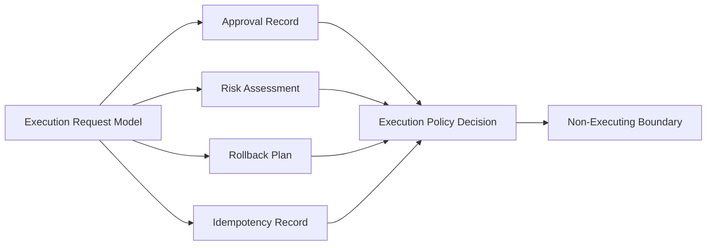
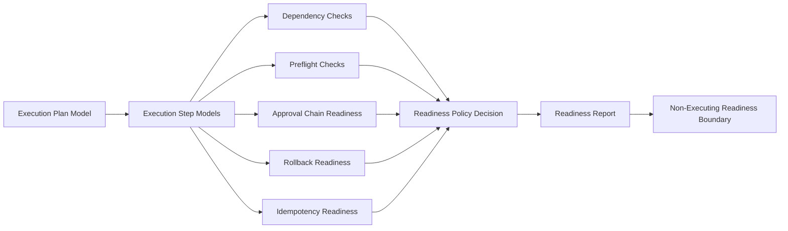
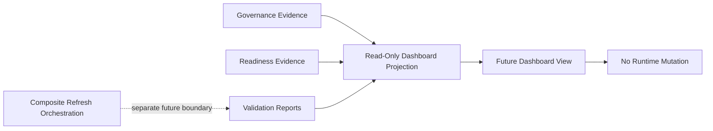
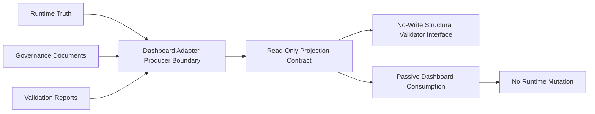
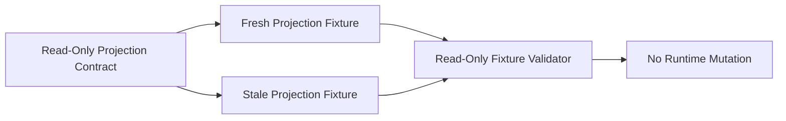

# AI Execution Graph

## Phase 9 State

Phase 9 does not add executable graph edges.

## Boundary

The graph is evaluative only. There is no node that dispatches work, calls providers, deploys code, reads secrets, or mutates external systems.

## Phase 10 Readiness State

Phase 10 adds readiness evaluation nodes only.

The readiness graph has no executable edge. A `ready-for-future-review` decision is not execution permission.

## Phase 12 Dashboard Boundary State

Phase 12 adds design-only dashboard projection boundaries. It does not add dashboard UI or runtime refresh execution.

The dashboard boundary graph is projection-only. A future dashboard view may display evidence and staleness, but it must not refresh, execute, deploy, call providers, read secrets, or mutate runtime state.

## Phase 13 Projection Contract State

Phase 13 adds contract and validation-interface nodes only.

The Phase 13 graph has no executable edge. The adapter boundary defines producer ownership for future projection JSON only; it does not implement refresh, execution, deployment, provider access, credential access, queueing, scheduling, workers, agents, or dashboard mutation.

## Phase 14 Projection Fixture Validation State

Phase 14 adds static fixture validation and timestamp-based stale-projection detection only.

The Phase 14 graph has no executable edge. Fixture validation reads committed JSON evidence and validates non-authoritative projection state; it does not refresh projections, write dashboard state, mutate runtime evidence, call providers, deploy, access credentials, queue work, schedule work, start workers, or run background agents.
