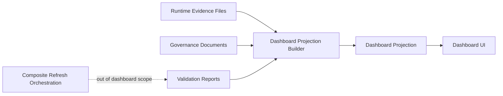

# Dashboard Runtime Boundary

## Purpose

The dashboard is a read-only projection surface. It may show Studio OS governance, readiness, validation, and health evidence, but it must not create, refresh, repair, approve, execute, deploy, schedule, enqueue, or mutate runtime state.

## Boundary Model

Dashboard projection and composite refresh orchestration are separate layers.

The dashboard may read a projection that was produced by trusted validation tooling. It must not invoke that tooling directly from UI code.

## Allowed Dashboard Responsibilities

- Read static projection artifacts.
- Render governance and readiness state.
- Show source file references and generated timestamps.
- Display validation status, stale-data warnings, and boundary warnings.
- Explain that readiness is evidence for future review only.

## Prohibited Dashboard Responsibilities

- Runtime writes.
- Provider calls.
- Deployment calls.
- Queue, worker, scheduler, executor, or agent creation.
- Secret, token, API key, or credential access.
- Approval mutation.
- Execution-policy mutation.
- Readiness-decision mutation.
- Composite refresh orchestration.
- Validator reimplementation.
- Business-rule reimplementation.

## Projection Contract

A future dashboard projection must be a derived artifact, not a source of authority. It should contain:

- Source report identities.
- Source document identities.
- Validation status summaries.
- Boundary flag summaries.
- Staleness metadata.
- Display labels.
- Links back to source evidence.

It must not contain:

- Commands.
- Script paths.
- API endpoints.
- Provider identifiers.
- Credentials.
- Approval write payloads.
- Execution payloads.
- Deployment payloads.
- Scheduler or queue configuration.

## Composite Refresh Boundary

Composite refresh orchestration is not a dashboard concern. A future refresh controller may coordinate validations, report generation, and projection generation only after a separate implementation phase explicitly authorizes that design.

Until then:

- Dashboard projection is design-only.
- Composite refresh is documentation-only.
- No refresh button may run validators.
- No UI state may be treated as runtime state.

## No-Write Validation Mode

No-write validation mode is a future validation mode that evaluates documents, contracts, reports, and projection inputs without writing runtime reports or mutating any source artifact.

Required semantics:

- Read source inputs.
- Evaluate existing validator rules.
- Return in-memory results to the caller.
- Mark `writesAllowed` as `false`.
- Mark `runtimeMutationAllowed` as `false`.
- Mark `projectionMutationAllowed` as `false`.
- Refuse provider, deployment, queue, worker, scheduler, executor, agent, secret, and credential capability.

No-write validation mode is safe for dashboard diagnostics because it produces inspection results only. It is not an execution-readiness grant and must not replace persisted governance validation.

## Validator And Business Logic Boundary

Dashboard code must not duplicate validator or business logic. It may only map validated projection fields to presentation state.

Correct ownership:

- Validators own rule evaluation.
- Governance documents own policy intent.
- Runtime evidence files own recorded validation outputs.
- Projection builders own read-only aggregation.
- Dashboard UI owns rendering only.

If a dashboard needs a new derived state, the state must be added to the projection contract or validator output first. UI-only inference is allowed only for formatting, filtering, grouping, and sorting.

## Execution-Readiness Visibility

Future execution-readiness visibility must show evidence status without implying permission.

Required labels:

- `not executable`
- `readiness evidence only`
- `provider calls disabled`
- `deployment disabled`
- `secret access disabled`

Forbidden labels:

- `ready to execute`
- `deployable`
- `approved to run`
- `execution enabled`
- `provider connected`

